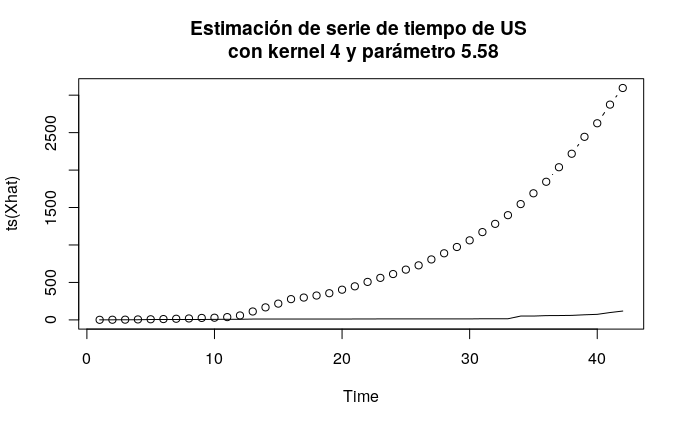
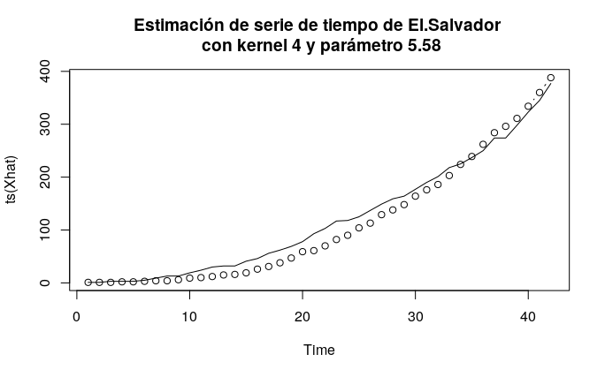

# Modelo-covid19

Este es un modelo **aun en desarrollo** que utiliza datos cuturales, demográficos, geográficos, socioeconómicos y biológicos de un país y su población como supuestos determinantes del crecimiento de la pandemia por COVID19. Esto se contrasta junto a la respuesta/reacción que cada país ha tenido medida en término de el número de pruebas que han realizado por millón, proporción de fallecidos, días sin cuarentena para hacer una predicción esperada del crecimiento temprano de la pandemia. 

En detalle los parámetros predictores utilizados son:
* **Culturales/demográfico/geográficos**
  * Densidad de población 
  * Conectividad 
  * Población en área urbana 

* **Socioeconómico**
  * Indice de pobreza
  * Ingreso per cápita
  * Indice de Gini
  * Escolaridad años promedio

* **Biológicos**
  * Edad promedio
  * Expectativa de vida al nacer

* **Otros**
  * Índice de transparencia CPI

Los parámetros de respuestas utilizados son:
* **Estratégicos frente a la pandemia**
  * Número de pruebas realizadas por millón
  * proporción de fallecidos 
  * Días sin cuarentena 

Para mayor información del modelo y cómo se usan estos parámetros, se anexa el archivo con nombre **Plan_de_analisis_covid.pdf**, que es un borrador temprano que me auxilió a planificar el código eventualmente construido en **modelo_covid.R**, el cual también se anexa. 

En ese código se pueden ver las notas explicativas de cada parte del código y cambiar lo que se desee para probar el rendimiento del modelo con distintos países del archivo **TS.csv** utilizando la función *Rendimiento* dentro del código. Cabe mencionar que el modelo rendirá mal para países con crecimiento bajo en los primeros días, pues asume que el virus comenzó a ser muestreado en la misma cantidad de días posteriores al primer caso confirmado, y no es el caso en todos, siendo uno extremo los estados unidos. Esto puede ser solucionado con una transformación de los datos.

Lo anterior se ilustra en el gráfico de US:

donde los puntos discretos son la aproximación del modelo mientras que la linea sólida son los datos. Esto quiere decir que el modelo estima que los casos en estados unidos tuvieron que haber crecido de esa manera de haberse comenzado a muestrear adecuadamente desde los días subsecuentes al primer caso. Esto se contrasta con el ejemplo de el salvador:

Este y otros ejemplos se colocan en la carpeta **Ejemplos**, así como también poder generar propios ejemplos con distintos kernels y parámetros en ellos ejecutando el código en máquina propia. 

**Este modelo será eventualmente actualizado.**
